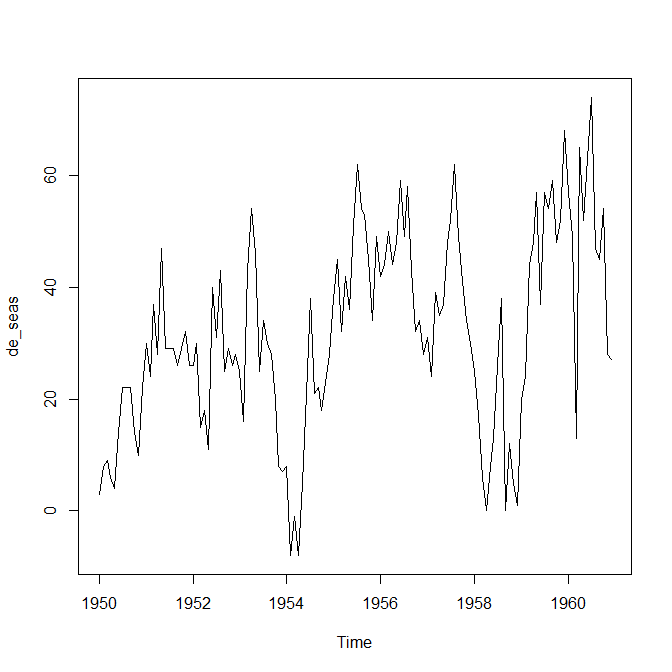

# Timeseries
Jose Parreno Garcia  
February 2018  
<style>
body {
text-align: justify}

</style>

<br>


```r
library(knitr)
```

Time series analysis and forecasting form an important part of many business domains, for example, trying to forecast demand vs sales.

* Understanding the components of a time series and xts package
* Stationarity, de-tren and de-seasonalize
* Lags, ACF, PACF, CCF
* Moving average and exponential smoothing
* Double exponential smoothing and Holt Winters
* ARIMA Modelling

<br>

# Understanding the components of a time series and xts package

## What is time series and how R handles it

A time series is any metric measured over regular time intervals. Common examples are the stock market indices, temperature measures on daily basis, etc.

R has its own way of dealing with time series objects, so let's first understand how to convert a numeric vector into a timeseries object.


```r
# Create a simple numeric vector
set.seed(100)
vec = round(runif(100,1,10),2)
vec
```

```
##   [1] 3.77 3.32 5.97 1.51 5.22 5.35 8.31 4.33 5.92 2.53 6.62 8.94 3.52 4.59 7.86 7.02 2.84 4.22 4.24 7.21 5.82 7.40 5.85 7.74 4.78 2.54 7.93 8.94 5.94 3.50 5.39 9.36 4.14 9.59 7.26 9.01 2.62 6.66 9.91 2.17 3.98 8.79 8.00 8.45 6.43 5.42 8.02 8.96 2.87
##  [50] 3.76 3.97 2.79 3.12 3.47 6.32 3.28 2.11 3.07 6.38 2.90 5.17 6.82 9.65 7.09 5.01 4.22 5.10 5.01 3.21 7.25 4.71 3.95 6.15 9.70 6.96 6.62 8.71 7.97 8.51 1.82 5.14 6.39 9.28 9.85 1.34 6.20 7.60 3.24 3.71 7.60 9.16 2.89 4.22 5.03 9.16 4.50 5.66 2.13
##  [99] 1.27 7.95
```

```r
# Quarterly data - frequency 4
q_ts = ts(vec, frequency = 4, start = c(1959, 2))
q_ts
```

```
##      Qtr1 Qtr2 Qtr3 Qtr4
## 1959      3.77 3.32 5.97
## 1960 1.51 5.22 5.35 8.31
## 1961 4.33 5.92 2.53 6.62
## 1962 8.94 3.52 4.59 7.86
## 1963 7.02 2.84 4.22 4.24
## 1964 7.21 5.82 7.40 5.85
## 1965 7.74 4.78 2.54 7.93
## 1966 8.94 5.94 3.50 5.39
## 1967 9.36 4.14 9.59 7.26
## 1968 9.01 2.62 6.66 9.91
## 1969 2.17 3.98 8.79 8.00
## 1970 8.45 6.43 5.42 8.02
## 1971 8.96 2.87 3.76 3.97
## 1972 2.79 3.12 3.47 6.32
## 1973 3.28 2.11 3.07 6.38
## 1974 2.90 5.17 6.82 9.65
## 1975 7.09 5.01 4.22 5.10
## 1976 5.01 3.21 7.25 4.71
## 1977 3.95 6.15 9.70 6.96
## 1978 6.62 8.71 7.97 8.51
## 1979 1.82 5.14 6.39 9.28
## 1980 9.85 1.34 6.20 7.60
## 1981 3.24 3.71 7.60 9.16
## 1982 2.89 4.22 5.03 9.16
## 1983 4.50 5.66 2.13 1.27
## 1984 7.95
```

```r
# Monthly data
m_ts = ts(vec, frequency = 12, start = 1990)
m_ts
```

```
##       Jan  Feb  Mar  Apr  May  Jun  Jul  Aug  Sep  Oct  Nov  Dec
## 1990 3.77 3.32 5.97 1.51 5.22 5.35 8.31 4.33 5.92 2.53 6.62 8.94
## 1991 3.52 4.59 7.86 7.02 2.84 4.22 4.24 7.21 5.82 7.40 5.85 7.74
## 1992 4.78 2.54 7.93 8.94 5.94 3.50 5.39 9.36 4.14 9.59 7.26 9.01
## 1993 2.62 6.66 9.91 2.17 3.98 8.79 8.00 8.45 6.43 5.42 8.02 8.96
## 1994 2.87 3.76 3.97 2.79 3.12 3.47 6.32 3.28 2.11 3.07 6.38 2.90
## 1995 5.17 6.82 9.65 7.09 5.01 4.22 5.10 5.01 3.21 7.25 4.71 3.95
## 1996 6.15 9.70 6.96 6.62 8.71 7.97 8.51 1.82 5.14 6.39 9.28 9.85
## 1997 1.34 6.20 7.60 3.24 3.71 7.60 9.16 2.89 4.22 5.03 9.16 4.50
## 1998 5.66 2.13 1.27 7.95
```

```r
# Yearly data
y_ts = ts(vec, frequency = 1, start = 2009)
y_ts
```

```
## Time Series:
## Start = 2009 
## End = 2108 
## Frequency = 1 
##   [1] 3.77 3.32 5.97 1.51 5.22 5.35 8.31 4.33 5.92 2.53 6.62 8.94 3.52 4.59 7.86 7.02 2.84 4.22 4.24 7.21 5.82 7.40 5.85 7.74 4.78 2.54 7.93 8.94 5.94 3.50 5.39 9.36 4.14 9.59 7.26 9.01 2.62 6.66 9.91 2.17 3.98 8.79 8.00 8.45 6.43 5.42 8.02 8.96 2.87
##  [50] 3.76 3.97 2.79 3.12 3.47 6.32 3.28 2.11 3.07 6.38 2.90 5.17 6.82 9.65 7.09 5.01 4.22 5.10 5.01 3.21 7.25 4.71 3.95 6.15 9.70 6.96 6.62 8.71 7.97 8.51 1.82 5.14 6.39 9.28 9.85 1.34 6.20 7.60 3.24 3.71 7.60 9.16 2.89 4.22 5.03 9.16 4.50 5.66 2.13
##  [99] 1.27 7.95
```

## Daily time series using xts

When it comes to computing daily time series, it is preferable to use the xts package (extended time series package). Let's compare how data is handled with ts() and xts().

* With the ts() function, the plots are not really clear
* With xts this becomes much more clear


```r
# With a ts object
d_ts = ts(vec, start = c(2009, 10), frequency = 365.25)
d_ts
```

```
## Time Series:
## Start = 2009.02464065708 
## End = 2009.29568788501 
## Frequency = 365.25 
##   [1] 3.77 3.32 5.97 1.51 5.22 5.35 8.31 4.33 5.92 2.53 6.62 8.94 3.52 4.59 7.86 7.02 2.84 4.22 4.24 7.21 5.82 7.40 5.85 7.74 4.78 2.54 7.93 8.94 5.94 3.50 5.39 9.36 4.14 9.59 7.26 9.01 2.62 6.66 9.91 2.17 3.98 8.79 8.00 8.45 6.43 5.42 8.02 8.96 2.87
##  [50] 3.76 3.97 2.79 3.12 3.47 6.32 3.28 2.11 3.07 6.38 2.90 5.17 6.82 9.65 7.09 5.01 4.22 5.10 5.01 3.21 7.25 4.71 3.95 6.15 9.70 6.96 6.62 8.71 7.97 8.51 1.82 5.14 6.39 9.28 9.85 1.34 6.20 7.60 3.24 3.71 7.60 9.16 2.89 4.22 5.03 9.16 4.50 5.66 2.13
##  [99] 1.27 7.95
```

```r
plot(d_ts)
```

<!-- -->

```r
# With xts object
library(xts)
d_xts = xts(vec, as.Date("2009-10-01")+0:99)
d_xts
```

```
##            [,1]
## 2009-10-01 3.77
## 2009-10-02 3.32
## 2009-10-03 5.97
## 2009-10-04 1.51
## 2009-10-05 5.22
## 2009-10-06 5.35
## 2009-10-07 8.31
## 2009-10-08 4.33
## 2009-10-09 5.92
## 2009-10-10 2.53
## 2009-10-11 6.62
## 2009-10-12 8.94
## 2009-10-13 3.52
## 2009-10-14 4.59
## 2009-10-15 7.86
## 2009-10-16 7.02
## 2009-10-17 2.84
## 2009-10-18 4.22
## 2009-10-19 4.24
## 2009-10-20 7.21
## 2009-10-21 5.82
## 2009-10-22 7.40
## 2009-10-23 5.85
## 2009-10-24 7.74
## 2009-10-25 4.78
## 2009-10-26 2.54
## 2009-10-27 7.93
## 2009-10-28 8.94
## 2009-10-29 5.94
## 2009-10-30 3.50
## 2009-10-31 5.39
## 2009-11-01 9.36
## 2009-11-02 4.14
## 2009-11-03 9.59
## 2009-11-04 7.26
## 2009-11-05 9.01
## 2009-11-06 2.62
## 2009-11-07 6.66
## 2009-11-08 9.91
## 2009-11-09 2.17
## 2009-11-10 3.98
## 2009-11-11 8.79
## 2009-11-12 8.00
## 2009-11-13 8.45
## 2009-11-14 6.43
## 2009-11-15 5.42
## 2009-11-16 8.02
## 2009-11-17 8.96
## 2009-11-18 2.87
## 2009-11-19 3.76
## 2009-11-20 3.97
## 2009-11-21 2.79
## 2009-11-22 3.12
## 2009-11-23 3.47
## 2009-11-24 6.32
## 2009-11-25 3.28
## 2009-11-26 2.11
## 2009-11-27 3.07
## 2009-11-28 6.38
## 2009-11-29 2.90
## 2009-11-30 5.17
## 2009-12-01 6.82
## 2009-12-02 9.65
## 2009-12-03 7.09
## 2009-12-04 5.01
## 2009-12-05 4.22
## 2009-12-06 5.10
## 2009-12-07 5.01
## 2009-12-08 3.21
## 2009-12-09 7.25
## 2009-12-10 4.71
## 2009-12-11 3.95
## 2009-12-12 6.15
## 2009-12-13 9.70
## 2009-12-14 6.96
## 2009-12-15 6.62
## 2009-12-16 8.71
## 2009-12-17 7.97
## 2009-12-18 8.51
## 2009-12-19 1.82
## 2009-12-20 5.14
## 2009-12-21 6.39
## 2009-12-22 9.28
## 2009-12-23 9.85
## 2009-12-24 1.34
## 2009-12-25 6.20
## 2009-12-26 7.60
## 2009-12-27 3.24
## 2009-12-28 3.71
## 2009-12-29 7.60
## 2009-12-30 9.16
## 2009-12-31 2.89
## 2010-01-01 4.22
## 2010-01-02 5.03
## 2010-01-03 9.16
## 2010-01-04 4.50
## 2010-01-05 5.66
## 2010-01-06 2.13
## 2010-01-07 1.27
## 2010-01-08 7.95
```

```r
plot(d_xts)
```

<!-- -->

## Multi-time series using xts

You can also work with multiseries using the xts package


```r
# Crate the 2 time series objects
set.seed(100)
vec1 = sample(1:100)
vec2 = round(vec1 + runif(100,10,20))

# Create a sequence of dates
library(lubridate)
dates = seq.Date(ymd("2009-10-01"), length.out = 100, by = "day")

# Create a df
df = data.frame(vec1, vec2)
rownames(df) = as.character(dates)
df
```

```
##            vec1 vec2
## 2009-10-01   31   44
## 2009-10-02   26   40
## 2009-10-03   55   65
## 2009-10-04    6   20
## 2009-10-05   45   61
## 2009-10-06   46   63
## 2009-10-07   77   97
## 2009-10-08   35   52
## 2009-10-09   51   61
## 2009-10-10   16   31
## 2009-10-11   57   75
## 2009-10-12   79   97
## 2009-10-13   25   36
## 2009-10-14   93  105
## 2009-10-15   66   86
## 2009-10-16   90  100
## 2009-10-17   18   37
## 2009-10-18   30   47
## 2009-10-19   83   95
## 2009-10-20   56   74
## 2009-10-21   43   57
## 2009-10-22   85   99
## 2009-10-23   42   57
## 2009-10-24   58   74
## 2009-10-25   32   46
## 2009-10-26   13   23
## 2009-10-27   94  114
## 2009-10-28   65   85
## 2009-10-29   40   56
## 2009-10-30   20   31
## 2009-10-31   87   99
## 2009-11-01   73   92
## 2009-11-02   24   41
## 2009-11-03   64   79
## 2009-11-04   95  111
## 2009-11-05   74   84
## 2009-11-06   12   27
## 2009-11-07   72   82
## 2009-11-08   62   77
## 2009-11-09    8   24
## 2009-11-10   71   88
## 2009-11-11   52   63
## 2009-11-12   86   97
## 2009-11-13   48   67
## 2009-11-14   34   45
## 2009-11-15   28   45
## 2009-11-16   80  100
## 2009-11-17   47   57
## 2009-11-18   11   21
## 2009-11-19   91  103
## 2009-11-20   17   32
## 2009-11-21   10   29
## 2009-11-22   67   78
## 2009-11-23   75   87
## 2009-11-24   98  114
## 2009-11-25   89  107
## 2009-11-26   97  115
## 2009-11-27   49   67
## 2009-11-28   99  109
## 2009-11-29    9   26
## 2009-11-30   19   37
## 2009-12-01   78   94
## 2009-12-02   37   52
## 2009-12-03   39   51
## 2009-12-04   50   61
## 2009-12-05   53   65
## 2009-12-06   92  102
## 2009-12-07   15   32
## 2009-12-08   61   79
## 2009-12-09   22   41
## 2009-12-10   70   84
## 2009-12-11   54   68
## 2009-12-12   36   52
## 2009-12-13   27   45
## 2009-12-14   84  102
## 2009-12-15   81   94
## 2009-12-16   21   41
## 2009-12-17   38   55
## 2009-12-18   63   78
## 2009-12-19    2   18
## 2009-12-20   29   42
## 2009-12-21   96  113
## 2009-12-22   69   88
## 2009-12-23   23   40
## 2009-12-24    1   13
## 2009-12-25   41   54
## 2009-12-26   59   70
## 2009-12-27    4   15
## 2009-12-28   82   95
## 2009-12-29   33   51
## 2009-12-30   60   80
## 2009-12-31   68   82
## 2010-01-01    3   15
## 2010-01-02  100  120
## 2010-01-03   44   61
## 2010-01-04   14   27
## 2010-01-05   76   87
## 2010-01-06   88  104
## 2010-01-07    7   18
## 2010-01-08    5   23
```

```r
df_xts = as.xts(df)
plot(df_xts$vec1, main = "Plot from XTS obj")
```

<!-- -->

```r
lines(df_xts$vec2)
```

<!-- -->

## Filtering dates using xts


```r
# Get all data for 2009 --> using head to show only first 5 rows
head(df_xts["2009"])
```

```
##            vec1 vec2
## 2009-10-01   31   44
## 2009-10-02   26   40
## 2009-10-03   55   65
## 2009-10-04    6   20
## 2009-10-05   45   61
## 2009-10-06   46   63
```

```r
# Get all data from 2009-10 to end --> using head to show only first 5 rows
head(df_xts["2009-10/"])
```

```
##            vec1 vec2
## 2009-10-01   31   44
## 2009-10-02   26   40
## 2009-10-03   55   65
## 2009-10-04    6   20
## 2009-10-05   45   61
## 2009-10-06   46   63
```

```r
# Get all data till start to 2009-10 --> using head to show only first 5 rows
head(df_xts["/2009-10"])
```

```
##            vec1 vec2
## 2009-10-01   31   44
## 2009-10-02   26   40
## 2009-10-03   55   65
## 2009-10-04    6   20
## 2009-10-05   45   61
## 2009-10-06   46   63
```

```r
# for stock prices 
to.monthly(df_xts)
```

```
##          df_xts.Open df_xts.High df_xts.Low df_xts.Close
## Oct 2009          31          94          6           87
## Nov 2009          73          99          8           19
## Dec 2009          78          96          1           68
## Jan 2010           3         100          3            5
```

```r
to.weekly(df_xts)
```

```
##            df_xts.Open df_xts.High df_xts.Low df_xts.Close
## 2009-10-04          31          55          6           45
## 2009-10-11          46          79         16           79
## 2009-10-18          25          93         18           83
## 2009-10-24          56          85         32           32
## 2009-11-01          13          94         13           73
## 2009-11-08          24          95         12           62
## 2009-11-15           8          86          8           28
## 2009-11-22          80          91         10           67
## 2009-11-29          75          99          9            9
## 2009-12-06          19          92         19           92
## 2009-12-13          15          70         15           27
## 2009-12-20          84          84          2           29
## 2009-12-27          96          96          1            4
## 2010-01-03          82         100          3           44
## 2010-01-08          14          88          5            5
```

```r
to.quarterly(df_xts)
```

```
##         df_xts.Open df_xts.High df_xts.Low df_xts.Close
## 2009 Q4          31          99          1           68
## 2010 Q1           3         100          3            5
```

```r
to.yearly(df_xts)
```

```
##            df_xts.Open df_xts.High df_xts.Low df_xts.Close
## 2009-12-31          31          99          1           68
## 2010-01-08           3         100          3            5
```

## Decomposing the timeseries object


```r
decomposedRes = decompose(m_ts, type = "mult")
plot(decomposedRes)
```

<!-- -->

```r
# The components shown in the graph can be extract using the stl() function
stlRes = stl(m_ts, s.window = "periodic", robust = T)
head(stlRes)
```

```
## $time.series
##             seasonal    trend    remainder
## Jan 1990 -1.59621136 4.498770  0.867441630
## Feb 1990 -0.66576100 4.621689 -0.635928157
## Mar 1990  1.37412456 4.744609 -0.148733151
## Apr 1990 -0.30541552 4.858171 -3.042755723
## May 1990 -1.00431022 4.971734  1.252576318
## Jun 1990 -0.13842060 5.080643  0.407777643
## Jul 1990  1.10472193 5.189552  2.015726051
## Aug 1990 -0.31258756 5.312793 -0.670205235
## Sep 1990 -1.18108211 5.436034  1.665048539
## Oct 1990  0.02458981 5.535207 -3.029796785
## Nov 1990  1.33596283 5.634380 -0.350343207
## Dec 1990  1.36438904 5.590269  1.985341756
## Jan 1991 -1.59621136 5.546158 -0.429946665
## Feb 1991 -0.66576100 5.549633 -0.293871910
## Mar 1991  1.37412456 5.553108  0.932767639
## Apr 1991 -0.30541552 5.623162  1.702253371
## May 1991 -1.00431022 5.693217 -1.848906284
## Jun 1991 -0.13842060 5.719616 -1.361195494
## Jul 1991  1.10472193 5.746016 -2.610737620
## Aug 1991 -0.31258756 5.757825  1.764762480
## Sep 1991 -1.18108211 5.769634  1.231447639
## Oct 1991  0.02458981 5.859267  1.516143187
## Nov 1991  1.33596283 5.948900 -1.434862363
## Dec 1991  1.36438904 6.028740  0.346870634
## Jan 1992 -1.59621136 6.108581  0.267630246
## Feb 1992 -0.66576100 6.136455 -2.930694219
## Mar 1992  1.37412456 6.164329  0.391546109
## Apr 1992 -0.30541552 6.227690  3.017725790
## May 1992 -1.00431022 6.291050  0.653260084
## Jun 1992 -0.13842060 6.375950 -2.737529668
## Jul 1992  1.10472193 6.460850 -2.175572338
## Aug 1992 -0.31258756 6.509543  3.163044266
## Sep 1992 -1.18108211 6.558236 -1.237154069
## Oct 1992  0.02458981 6.551747  3.013662815
## Nov 1992  1.33596283 6.545259 -0.621221399
## Dec 1992  1.36438904 6.598371  1.047240104
## Jan 1993 -1.59621136 6.651483 -2.435271777
## Feb 1993 -0.66576100 6.710757  0.615004256
## Mar 1993  1.37412456 6.770030  1.765845082
## Apr 1993 -0.30541552 6.778506 -4.303090831
## May 1993 -1.00431022 6.786982 -1.802672130
## Jun 1993 -0.13842060 6.754807  2.173613972
## Jul 1993  1.10472193 6.722631  0.172647157
## Aug 1993 -0.31258756 6.585798  2.176789329
## Sep 1993 -1.18108211 6.448966  1.162116562
## Oct 1993  0.02458981 6.188985 -0.793575238
## Nov 1993  1.33596283 5.929005  0.755031863
## Dec 1993  1.36438904 5.612547  1.983064433
## Jan 1994 -1.59621136 5.296088 -0.829876382
## Feb 1994 -0.66576100 4.971862 -0.546101344
## Mar 1994  1.37412456 4.647637 -2.051761514
## Apr 1994 -0.30541552 4.390971 -1.295555603
## May 1994 -1.00431022 4.134305 -0.009995079
## Jun 1994 -0.13842060 4.043847 -0.435426297
## Jul 1994  1.10472193 3.953389  1.261889567
## Aug 1994 -0.31258756 4.145476 -0.552888420
## Sep 1994 -1.18108211 4.337563 -1.046481348
## Oct 1994  0.02458981 4.625175 -1.579764687
## Nov 1994  1.33596283 4.912786  0.131250876
## Dec 1994  1.36438904 5.079734 -3.544122564
## Jan 1995 -1.59621136 5.246681  1.519530611
## Feb 1995 -0.66576100 5.362820  2.122940865
## Mar 1995  1.37412456 5.478960  2.796915913
## Apr 1995 -0.30541552 5.565173  1.830242532
## May 1995 -1.00431022 5.651386  0.362923763
## Jun 1995 -0.13842060 5.632354 -1.273933454
## Jul 1995  1.10472193 5.613322 -1.618043587
## Aug 1995 -0.31258756 5.591606 -0.269018205
## Sep 1995 -1.18108211 5.569890 -1.178807763
## Oct 1995  0.02458981 5.698525  1.526885015
## Nov 1995  1.33596283 5.827160 -2.453123306
## Dec 1995  1.36438904 6.062397 -3.476786099
## Jan 1996 -1.59621136 6.297634  1.448577724
## Feb 1996 -0.66576100 6.475129  3.890632241
## Mar 1996  1.37412456 6.652624 -1.066748449
## Apr 1996 -0.30541552 6.779734  0.145681618
## May 1996 -1.00431022 6.906844  2.807466298
## Jun 1996 -0.13842060 6.958399  1.150021733
## Jul 1996  1.10472193 7.009954  0.395324250
## Aug 1996 -0.31258756 6.894702 -4.762114137
## Sep 1996 -1.18108211 6.779450 -0.458367465
## Oct 1996  0.02458981 6.590375 -0.224964442
## Nov 1996  1.33596283 6.401300  1.542737483
## Dec 1996  1.36438904 6.271903  2.213708030
## Jan 1997 -1.59621136 6.142506 -3.206294808
## Feb 1997 -0.66576100 6.068700  0.797060761
## Mar 1997  1.37412456 5.994894  0.230981123
## Apr 1997 -0.30541552 5.894695 -2.349279496
## May 1997 -1.00431022 5.794496 -1.080185503
## Jun 1997 -0.13842060 5.692695  2.045725542
## Jul 1997  1.10472193 5.590894  2.464383669
## Aug 1997 -0.31258756 5.484118 -2.281530154
## Sep 1997 -1.18108211 5.377341  0.023741083
## Oct 1997  0.02458981 5.303820 -0.298409452
## Nov 1997  1.33596283 5.230298  2.593738914
## Dec 1997  1.36438904 5.159387 -2.023775755
## Jan 1998 -1.59621136 5.088475  2.167736192
## Feb 1998 -0.66576100 5.008440 -2.212678917
## Mar 1998  1.37412456 4.928405 -5.032529232
## Apr 1998 -0.30541552 4.841675  3.413740968
## 
## $weights
##   [1] 0.9810668 0.9898014 0.9994409 0.7796205 0.9607259 0.9958002 0.8999102 0.9886757 0.9311350 0.7813786 0.9968992 0.9028306 0.9953317 0.9978177 0.9781230 0.9280813 0.9154402 0.9537039 0.8350991 0.9228102 0.9620272 0.9427275 0.9486246 0.9969606
##  [25] 0.9981900 0.7946356 0.9961274 0.7830120 0.9892395 0.8195052 0.8839147 0.7630464 0.9616779 0.7835601 0.9902668 0.9724653 0.8556791 0.9904604 0.9227161 0.5866399 0.9195284 0.8841161 0.9992465 0.8837886 0.9661469 0.9841411 0.9856389 0.9030475
##  [49] 0.9826635 0.9924741 0.8964002 0.9580137 0.9999975 0.9952124 0.9601456 0.9922863 0.9725039 0.9378979 0.9995645 0.7076390 0.9424755 0.8893006 0.8119974 0.9171021 0.9966726 0.9593896 0.9349039 0.9981711 0.9651760 0.9419254 0.8536400 0.7177294
##  [73] 0.9476517 0.6539125 0.9714370 0.9994636 0.8106525 0.9668419 0.9960527 0.5088283 0.9946950 0.9987208 0.9407320 0.8799417 0.7569726 0.9840027 0.9986514 0.8653286 0.9707180 0.8969902 0.8523464 0.8727254 0.9999857 0.9977503 0.8371391 0.8991345
##  [97] 0.8847178 0.8800543 0.4621999 0.7270547
## 
## $call
## stl(x = m_ts, s.window = "periodic", robust = T)
## 
## $win
##    s    t    l 
## 1001   19   13 
## 
## $deg
## s t l 
## 0 1 1 
## 
## $jump
##   s   t   l 
## 101   2   2
```

```r
head(stlRes$time.series)
```

```
##            seasonal    trend  remainder
## Jan 1990 -1.5962114 4.498770  0.8674416
## Feb 1990 -0.6657610 4.621689 -0.6359282
## Mar 1990  1.3741246 4.744609 -0.1487332
## Apr 1990 -0.3054155 4.858171 -3.0427557
## May 1990 -1.0043102 4.971734  1.2525763
## Jun 1990 -0.1384206 5.080643  0.4077776
```

## Additive vs Multiplicative timeseries

* You can see that additive is the sum of seasonality, trend and remainder
* Whilst multiplicative is the product.


<br>

# Stationarity, de-trending and de-seasonalize

In the previous section, we introduced timeseries, how R handles this and the xts package. In this section we will dig a bit deeper into concepts of timeseries like:

* Stationarity vs non-stationarity
* De-trending time series
* De-seasonalizing time series  

## Stationarity vs non-stationarity

* Stationary time series is one whose statistical characteristics do not change over time. Particularly, the mean value of the time series is pretty much constant over time, the variance does not increase over time and the seasonality effect is minimal.
* Non-stationary time series is obviously the opposite :)
* We can check for stationarity in R using the Augmented Dickey Fuller Test (ADF test)


```r
library(tseries)

# Data -> random noise
set.seed((100))
x = runif(1000)
adf.test(x)
```

```
## Warning in adf.test(x): p-value smaller than printed p-value
```

```
## 
## 	Augmented Dickey-Fuller Test
## 
## data:  x
## Dickey-Fuller = -10.151, Lag order = 9, p-value = 0.01
## alternative hypothesis: stationary
```

```r
plot(x)
```

<!-- -->

```r
## Since the p-value is less than 0.05, we reject the null hypothesis, therefore we can accept the alterntive hypothesis (stationary dataset)

# Data -> non stationary
adf.test(JohnsonJohnson)
```

```
## Warning in adf.test(JohnsonJohnson): p-value greater than printed p-value
```

```
## 
## 	Augmented Dickey-Fuller Test
## 
## data:  JohnsonJohnson
## Dickey-Fuller = 1.9321, Lag order = 4, p-value = 0.99
## alternative hypothesis: stationary
```

```r
plot(JohnsonJohnson)
```

<!-- -->

```r
## Clearly, now the p-value is much higher than the assumed 0.05 p-value, therefore we cannot reject the null hypothesis, which means that the JohnsonJohnson dataset is being tagged as a non-stationary time series dataset.
```

## Stationarising a time-series

Stationarising a time series is important for ARIMA modelling (which we will discuss later). How do we do this in R?

* A common approach is to substract successive observations - also called differencing
* In the forecast package, we can calculate the number of differencing needed to make it stationary
* The actual difference can be done using the div() function
* Ideally, before differencing, we should determine if any seasonal differencing is needed using the nsdifs() function
* Instead of substracting succesive observations, we subtract observations that are separated by the frequency of the time series
* If required, seasonal difference can be done by setting the lag option in the div function


```r
library(forecast)
## You can see that there is a lot of seasonality in this dataset. There is periodic increase, decrease in the trend
x = AirPassengers
plot(x)
```

<!-- -->

```r
## Let's see what happens when we de-seasonalize
# Seasonal differencing
ns = nsdiffs(x)
ns ## --> it says that 1 seasonal diff is required
```

```
## [1] 1
```

```r
if(ns > 0){de_seas = diff(x , lag = frequency(x), differences = ns)
}else{de_seas = x}

plot(de_seas)
```

<!-- -->

```r
## Now lets do regular differencing to the de_seas dataset to make it stationary!
n = ndiffs(de_seas)
if(n > 0){differenced = diff(de_seas, differences = n)}

plot(differenced)
```

<!-- -->

## De-seasonalising a time-series whilst not affecting the trend

This can be done by removing the seasonal component after decomposing a time series.


```r
# Decompose the timeseries
ts.stl = stl(AirPassengers, "periodic")

# Substract the trend part
de_seas = AirPassengers - ts.stl$time.series[,1]
plot(de_seas, type = 'l', main = "De-Seasonalise")
```

<!-- -->

```r
de_trend = AirPassengers - ts.stl$time.series[,2]
plot(de_trend, type = 'l', main = "De-Trend")
```

<!-- -->

<br>


# Lags, ACF, PACF, CCF

In this section we will see:

* Lags and how to create them
* Autocorrelation
* Partial autocorrelation
* Cross correlation

## Lags and how to create them

A lag of a timeseries is one where the data points are pushed forward by n units of time. 


```r
AirPassengers
```

```
##      Jan Feb Mar Apr May Jun Jul Aug Sep Oct Nov Dec
## 1949 112 118 132 129 121 135 148 148 136 119 104 118
## 1950 115 126 141 135 125 149 170 170 158 133 114 140
## 1951 145 150 178 163 172 178 199 199 184 162 146 166
## 1952 171 180 193 181 183 218 230 242 209 191 172 194
## 1953 196 196 236 235 229 243 264 272 237 211 180 201
## 1954 204 188 235 227 234 264 302 293 259 229 203 229
## 1955 242 233 267 269 270 315 364 347 312 274 237 278
## 1956 284 277 317 313 318 374 413 405 355 306 271 306
## 1957 315 301 356 348 355 422 465 467 404 347 305 336
## 1958 340 318 362 348 363 435 491 505 404 359 310 337
## 1959 360 342 406 396 420 472 548 559 463 407 362 405
## 1960 417 391 419 461 472 535 622 606 508 461 390 432
```

```r
# Create a lead - push the data 1 month backwards
ap_lead1 = dplyr::lead(AirPassengers, n = 1)
ap_lead1
```

```
##      Jan Feb Mar Apr May Jun Jul Aug Sep Oct Nov Dec
## 1949 118 132 129 121 135 148 148 136 119 104 118 115
## 1950 126 141 135 125 149 170 170 158 133 114 140 145
## 1951 150 178 163 172 178 199 199 184 162 146 166 171
## 1952 180 193 181 183 218 230 242 209 191 172 194 196
## 1953 196 236 235 229 243 264 272 237 211 180 201 204
## 1954 188 235 227 234 264 302 293 259 229 203 229 242
## 1955 233 267 269 270 315 364 347 312 274 237 278 284
## 1956 277 317 313 318 374 413 405 355 306 271 306 315
## 1957 301 356 348 355 422 465 467 404 347 305 336 340
## 1958 318 362 348 363 435 491 505 404 359 310 337 360
## 1959 342 406 396 420 472 548 559 463 407 362 405 417
## 1960 391 419 461 472 535 622 606 508 461 390 432  NA
```

```r
# Create a lag - push the data 1 month forward
ap_lag1 = stats::lag(AirPassengers, n = 1)
ap_lag1
```

```
##      Jan Feb Mar Apr May Jun Jul Aug Sep Oct Nov Dec
## 1948                                             112
## 1949 118 132 129 121 135 148 148 136 119 104 118 115
## 1950 126 141 135 125 149 170 170 158 133 114 140 145
## 1951 150 178 163 172 178 199 199 184 162 146 166 171
## 1952 180 193 181 183 218 230 242 209 191 172 194 196
## 1953 196 236 235 229 243 264 272 237 211 180 201 204
## 1954 188 235 227 234 264 302 293 259 229 203 229 242
## 1955 233 267 269 270 315 364 347 312 274 237 278 284
## 1956 277 317 313 318 374 413 405 355 306 271 306 315
## 1957 301 356 348 355 422 465 467 404 347 305 336 340
## 1958 318 362 348 363 435 491 505 404 359 310 337 360
## 1959 342 406 396 420 472 548 559 463 407 362 405 417
## 1960 391 419 461 472 535 622 606 508 461 390 432
```

Why are lags important? They are important because for most time series, the current observation can be dependant on the previous few observations, in other words, the timeseries can be dependent on its own lags. Therefore the lags can be used to predict the current and future values. But how many lags is the timeseries dependent on? This is where auto-correlation fits in.

## Autocorrelation

Autocorrelation is nothing but the correlation of the timeseries with lags of itself, in other words, it is a way of finding out hoy many past data points is the current data point dependent on. We can use the Acf() function to understand this. Check the graph below

* Vertical lines show the correlation of the respective lags with the original time series.
* For example, the line at 6 is the correlation of the 6th lag against the original time series.
* Top half of the chart is positive correlation and bottom half is negative.
* If a vertical line crosses the dashed blue line, that lag is significantly correlated with the original time series.
* In this case, there is significant autocorrelation for all!


```r
# Calculating ACF
acfRes = Acf(AirPassengers)
```

<!-- -->

If we repeated this with a stationary timeseries dataset:


```r
# data
set.seed(100)
x = runif(100)

# Calculating ACF
acfRes = Acf(x)
```

<!-- -->

## Partial autocorrelation

Partial autocorrelation is similar to ACF, but with the linear dependences of all the lags between them removed.

* Unlike ACF, the vertical lines fall very quick and not many lags are not correlated with the original time seris


```r
# Calculating ACF
pacfRes = Pacf(AirPassengers)
```

<!-- -->

## Cross correlation

A cross correlation is applying ACF to 2 different timeseries and comparing them


```r
# Calculating ACF
ccfRes = ccf(mdeaths, fdeaths, ylab = "cross-correlation")
```

<!-- -->

<br>

# Forecasting with moving average 

The idea of using a moving average instead of the average of the whole series, is that we can start investigating trends with fixed ranges of time. For example, if we are interested in the whole dataset, the moving average can be set to get the whole date range and we will get a flat line or single value for the average. If we start narrowing the date ranges, for example to only 3 days, then the average will be moving along the time series using values for 3 days, making it much more dynamic and variable.


```r
library(forecast)
out = ma(AirPassengers, 5)
plot(AirPassengers)
lines(out, col = "red")
```

<!-- -->

<br>

# Forecasting with exponential smoothing

Exponential smoothing effectively takes all data points into consideration when computing the forecast, but it gives exponentially decreasing weights to earlier (older) data points. Based on a given $\alpha$ parameter, it weighs between the actuals and estimated values of the previous observation to try to get a correct forecast.


```r
# Explicitly assigning the alpha value, and forecasting 2 records
out = ses(AirPassengers, initial = "simple", alpha = 0.3, h = 2)
out
```

```
##          Point Forecast    Lo 80    Hi 80    Lo 95    Hi 95
## Jan 1961       461.7666 403.1745 520.3586 372.1578 551.3754
## Feb 1961       461.7666 400.5947 522.9385 368.2122 555.3209
```

```r
# Explicitly assigning the alpha value, and forecasting 2 records
out1 = ses(AirPassengers, initial = "simple", alpha = 0.5, h = 2)

# Plotting actuals and the previous 2 forecasts
plot(window(AirPassengers, start = 1956), xlim = c(1956, 1962), main = "AirPassengers", type = "o")
lines(out$mean, col = "red", type = "o")
lines(out1$mean, col = "blue", type = "o")
```

<!-- -->

<br>

# Forecasting with Double Exponential (or simple Holt)

For time series that contain trend and seasonality, the previous methods don't work that well and we need methods that take them into consideration as well (double exponential and holt winters).

* Exponential smoothing does not excel when there is a trend in the data.
* This can be improved by introducing a trend factor, so that the forecast is the sum of trend and the basic level components


When implementing in R we can use the **holt()** function. You can see that the summary shows the $\alpha$ and $\beta$ coefficients used in the above formula, and the error metrics on the used data.


```r
library(forecast)
data("ausair", package = "fpp")

# Double exponential smoothing or just holt
hfit1 = holt(ausair, initial = "simple")
summary(hfit1)
```

```
## 
## Forecast method: Holt's method
## 
## Model Information:
## Holt's method 
## 
## Call:
##  holt(y = ausair, initial = "simple") 
## 
##   Smoothing parameters:
##     alpha = 0.9936 
##     beta  = 0.1082 
## 
##   Initial states:
##     l = 7.3187 
##     b = 0.0079 
## 
##   sigma:  1.5816
## Error measures:
##                     ME     RMSE      MAE      MPE     MAPE      MASE        ACF1
## Training set 0.3359269 1.581603 1.097671 1.698105 5.325964 0.7493478 -0.05903325
## 
## Forecasts:
##      Point Forecast    Lo 80    Hi 80    Lo 95    Hi 95
## 2010       51.50054 49.47364 53.52745 48.40066 54.60043
## 2011       52.95313 49.93726 55.96899 48.34076 57.56549
## 2012       54.40571 50.51852 58.29291 48.46076 60.35066
## 2013       55.85830 51.14141 60.57519 48.64443 63.07216
## 2014       57.31088 51.77843 62.84334 48.84973 65.77204
## 2015       58.76347 52.41655 65.11039 49.05669 68.47024
## 2016       60.21605 53.04867 67.38344 49.25449 71.17762
## 2017       61.66864 53.67063 69.66665 49.43674 73.90054
## 2018       63.12122 54.27985 71.96260 49.59950 76.64295
## 2019       64.57381 54.87468 74.27294 49.74028 79.40734
```

```r
# Set an exponential trend to make it steeper
hfit2 = holt(ausair, initial = "simple", exponential = T)
summary(hfit2)
```

```
## 
## Forecast method: Holt's method with exponential trend
## 
## Model Information:
## Holt's method with exponential trend 
## 
## Call:
##  holt(y = ausair, initial = "simple", exponential = T) 
## 
##   Smoothing parameters:
##     alpha = 0.9982 
##     beta  = 0.0435 
## 
##   Initial states:
##     l = 7.3187 
##     b = 1.0011 
## 
##   sigma:  0.0786
## Error measures:
##                     ME     RMSE      MAE      MPE     MAPE     MASE        ACF1
## Training set 0.2671929 1.575321 1.097509 1.705256 5.382345 0.749237 -0.04604042
## 
## Forecasts:
##      Point Forecast    Lo 80     Hi 80    Lo 95     Hi 95
## 2010       52.11873 46.80937  57.41715 43.83810  60.09444
## 2011       54.29049 46.38722  62.26853 42.63494  66.79452
## 2012       56.55275 46.55822  67.11146 41.91960  73.74755
## 2013       58.90928 46.78833  72.19330 40.85457  79.73703
## 2014       61.36401 47.07983  76.88886 40.89381  86.66671
## 2015       63.92102 47.61064  82.40937 40.85279  94.94342
## 2016       66.58458 47.83501  88.14413 40.75621 102.12696
## 2017       69.35913 48.60713  94.36913 40.44216 111.45833
## 2018       72.24930 48.99142 100.59680 39.82215 118.66902
## 2019       75.25990 49.36728 107.78362 40.10673 128.17881
```

```r
# Add damping factor
hfit3 = holt(ausair, damped = T)
summary(hfit3)
```

```
## 
## Forecast method: Damped Holt's method
## 
## Model Information:
## Damped Holt's method 
## 
## Call:
##  holt(y = ausair, damped = T) 
## 
##   Smoothing parameters:
##     alpha = 0.991 
##     beta  = 0.1068 
##     phi   = 0.98 
## 
##   Initial states:
##     l = 6.6073 
##     b = 0.7801 
## 
##   sigma:  1.5792
## 
##      AIC     AICc      BIC 
## 196.1089 198.6544 206.2422 
## 
## Error measures:
##                     ME     RMSE      MAE       MPE     MAPE     MASE        ACF1
## Training set 0.2701726 1.579205 1.106721 0.6051288 5.337057 0.755526 -0.03298327
## 
## Forecasts:
##      Point Forecast    Lo 80    Hi 80    Lo 95    Hi 95
## 2010       51.29561 49.27178 53.31944 48.20042 54.39079
## 2011       52.51210 49.50985 55.51435 47.92055 57.10365
## 2012       53.70426 49.84481 57.56371 47.80174 59.60678
## 2013       54.87258 50.20291 59.54225 47.73093 62.01423
## 2014       56.01753 50.55816 61.47691 47.66814 64.36692
## 2015       57.13959 50.89879 63.38038 47.59511 66.68406
## 2016       58.23920 51.21884 65.25956 47.50249 68.97591
## 2017       59.31682 51.51517 67.11847 47.38522 71.24841
## 2018       60.37289 51.78615 68.95962 47.24061 73.50517
## 2019       61.40783 52.03104 70.78462 47.06727 75.74840
```

```r
# Plotting the 3 methods above
plot(ausair, main = "Air Passengers - Australia", type = "o", xlim = c(1970, 2019), ylim = c(0,70))
lines(fitted(hfit1), col = "red", lty = 2)
lines(fitted(hfit2), col = "green", lty = 2)
lines(fitted(hfit3), col = "blue", lty = 2)
lines(hfit1$mean, col = "red", type = "o")
lines(hfit2$mean, col = "green", type = "o")
lines(hfit3$mean, col = "blue", type = "o")
```

<!-- -->

<br>

# Forecasting with Triple exponential smoothing (Holt Winters method)

Just like the double exponential method introduced the trend component, Holt Winters (triple exponential smoothing) adds also a seasonal component.


Holt Winters can be calculated using the **hw()** function.


```r
# method 1
hw_fit1 = hw(JohnsonJohnson, seasona = "additive")
summary(hw_fit1)
```

```
## 
## Forecast method: Holt-Winters' additive method
## 
## Model Information:
## Holt-Winters' additive method 
## 
## Call:
##  hw(y = JohnsonJohnson, seasonal = "additive") 
## 
##   Smoothing parameters:
##     alpha = 0.0825 
##     beta  = 0.0549 
##     gamma = 0.9146 
## 
##   Initial states:
##     l = 0.8488 
##     b = -0.0067 
##     s=-0.6581 0.6372 -0.093 0.1138
## 
##   sigma:  0.439
## 
##      AIC     AICc      BIC 
## 251.8757 254.3082 273.7531 
## 
## Error measures:
##                     ME      RMSE       MAE      MPE     MAPE      MASE       ACF1
## Training set 0.0880635 0.4389846 0.3047098 3.177082 9.889385 0.4342915 -0.1170692
## 
## Forecasts:
##         Point Forecast    Lo 80    Hi 80    Lo 95    Hi 95
## 1981 Q1       17.81183 17.24925 18.37441 16.95143 18.67222
## 1981 Q2       16.25326 15.68540 16.82112 15.38479 17.12173
## 1981 Q3       17.61641 17.03835 18.19447 16.73235 18.50048
## 1981 Q4       13.20631 12.61178 13.80084 12.29706 14.11557
## 1982 Q1       19.40800 18.50147 20.31453 18.02158 20.79442
## 1982 Q2       17.84943 16.92096 18.77791 16.42945 19.26942
## 1982 Q3       19.21259 18.25567 20.16950 17.74911 20.67606
## 1982 Q4       14.80249 13.81025 15.79473 13.28499 16.31999
```

```r
# method 2
hw_fit2 = hw(JohnsonJohnson, seasona = "multiplicative")
summary(hw_fit2)
```

```
## 
## Forecast method: Holt-Winters' multiplicative method
## 
## Model Information:
## Holt-Winters' multiplicative method 
## 
## Call:
##  hw(y = JohnsonJohnson, seasonal = "multiplicative") 
## 
##   Smoothing parameters:
##     alpha = 0.1879 
##     beta  = 0.1072 
##     gamma = 5e-04 
## 
##   Initial states:
##     l = 0.157 
##     b = 0.0753 
##     s=0.7894 1.0705 1.051 1.0891
## 
##   sigma:  0.2548
## 
##      AIC     AICc      BIC 
## 344.6296 347.0620 366.5070 
## 
## Error measures:
##                      ME      RMSE       MAE        MPE     MAPE      MASE       ACF1
## Training set 0.01093517 0.4538198 0.3659965 -0.9932093 13.29007 0.5216412 -0.2939211
## 
## Forecasts:
##         Point Forecast     Lo 80    Hi 80     Lo 95    Hi 95
## 1981 Q1       16.86559 11.357969 22.37322 8.4424096 25.28877
## 1981 Q2       16.61346 10.951738 22.27518 7.9546035 25.27232
## 1981 Q3       17.27189 10.969184 23.57459 7.6327348 26.91104
## 1981 Q4       12.99433  7.804029 18.18463 5.0564489 20.93221
## 1982 Q1       18.25449 10.151330 26.35764 5.8617790 30.64719
## 1982 Q2       17.95401  9.028852 26.87916 4.3041608 31.60385
## 1982 Q3       18.63802  8.238238 29.03780 2.7329274 34.54311
## 1982 Q4       14.00221  5.244176 22.76024 0.6079541 27.39646
```

```r
# plotting both methods
plot(JohnsonJohnson, type = "o", xlim = c(1960, 1983), ylim = c(0, 20), main = "JohnsonJohnson")
lines(fitted(hw_fit1), col ="blue", lty = 2)
lines(fitted(hw_fit2), col ="red", lty = 2)
lines(hw_fit1$mean, col ="blue", type = "o")
lines(hw_fit2$mean, col ="red", type = "o")
```

<!-- -->

<br>

# ARIMA Modelling

In this section, we are going to explore even more advanced methods for forecasting than the previous ones, as these new methods also use regression methods under the hood. The family of some of these methods is ARIMA.


Lets see how the (p), (d) and (q) are determined:

* The first requirement for ARIMA modelling is to have a time series that is adequetly stationarised
* The (d) represents the number of non-seasonal differencing required to make it stationary
* (p) is the number of lags (or autoregressive terms) of the different series
* (q) is the number of moving average terms
* An ARMA model is like a regression equation, where the time series is modelled as a linear function, of its past values or lags
* We have the AR working with order p
* We have the MA working with order q
* It is generally recommended to keep p and q lower or equal to 2
* A good model will have the final error looking like white noise
* What happens with the d? Well, unless we have an automatic way of checking multiple d, we will have to manually to this to many time series


## Auto-ARIMA

* You can implement auto ARIMA with the **auto.arima()** function in R.
* You can see how the function has returned an ARIMA model of order (0,1,1) -> p = 0, d = 1, q = 1
* The second part of the ARIMA represents the seasonal part
* The [4] denotes the number of periods per cycle


```r
# Prepare the data
train = window(JohnsonJohnson, start = c(1960), end = c(1975))
test = window(JohnsonJohnson, start = c(1976), end = c(1980))

# Auto ARIMA
fit = auto.arima(train)
fit
```

```
## Series: train 
## ARIMA(0,1,1)(0,1,1)[4] 
## 
## Coefficients:
##           ma1     sma1
##       -0.5538  -0.3694
## s.e.   0.1267   0.1148
## 
## sigma^2 estimated as 0.06095:  log likelihood=-0.62
## AIC=7.24   AICc=7.7   BIC=13.31
```

```r
# Forecast the model
predicted = forecast(fit, h = 20)$mean
accuracy(predicted, test)
```

```
##                ME     RMSE      MAE     MPE     MAPE       ACF1 Theil's U
## Test set 1.798787 2.507806 1.868717 13.9938 14.98701 0.05581759 0.8871455
```

## Adding external regressors to auto-ARIMA


```r
# Auto-ARIMA with external regressors
fit = auto.arima(train, xreg = fourier(train, 2))
predicted = forecast(fit, h = 20, xreg = fourier(train, 2, 20))$mean
accuracy(predicted, test)
```

```
##               ME     RMSE      MAE      MPE     MAPE        ACF1 Theil's U
## Test set 1.95536 2.727626 2.051029 15.18687 16.55236 -0.00449938 0.9627329
```


